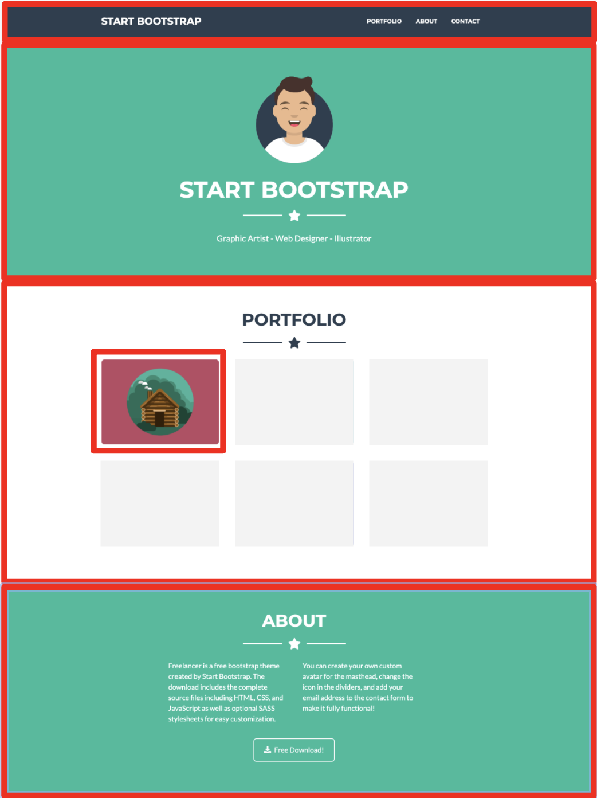
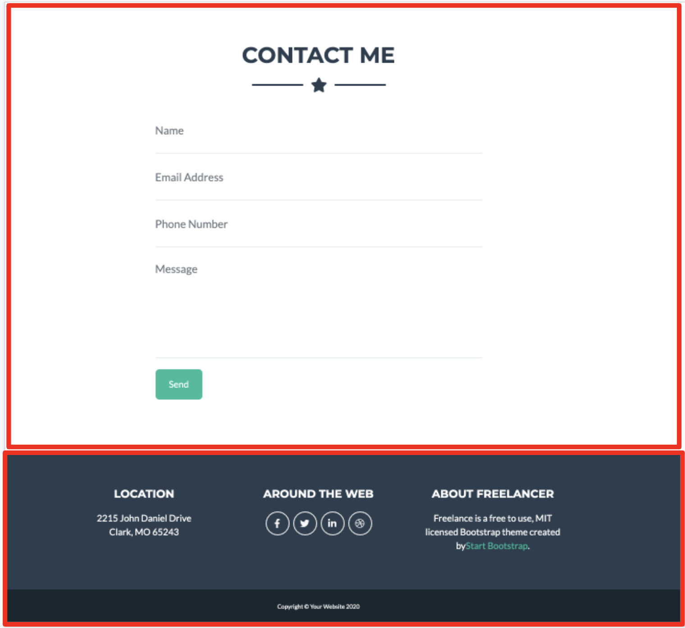

## Layout simple utilizando Reactjs

## Instalación

- Realice un fork del repositorio

Una vez que el repositorio se encuentre en su github realizar:

- Clonar el repositorio a su computador

- Instalar dependencias con el comando
`yarn install`

-- Ejecutar el proyecto
`yarn start`

- Realizar los siguientes componentes

- Subir los cambios a su repositorio

## create a new repository on the command line
echo "# sodimac-react-bootstrap" >> README.md
git init
git add README.md
git commit -m "first commit"
git branch -M master
git remote add origin https://github.com/mortegac/sodimac-react-bootstrap.git
git push -u origin master
                
## push an existing repository from the command line
git remote add origin https://github.com/mortegac/sodimac-react-bootstrap.git
git branch -M master
git push -u origin master
